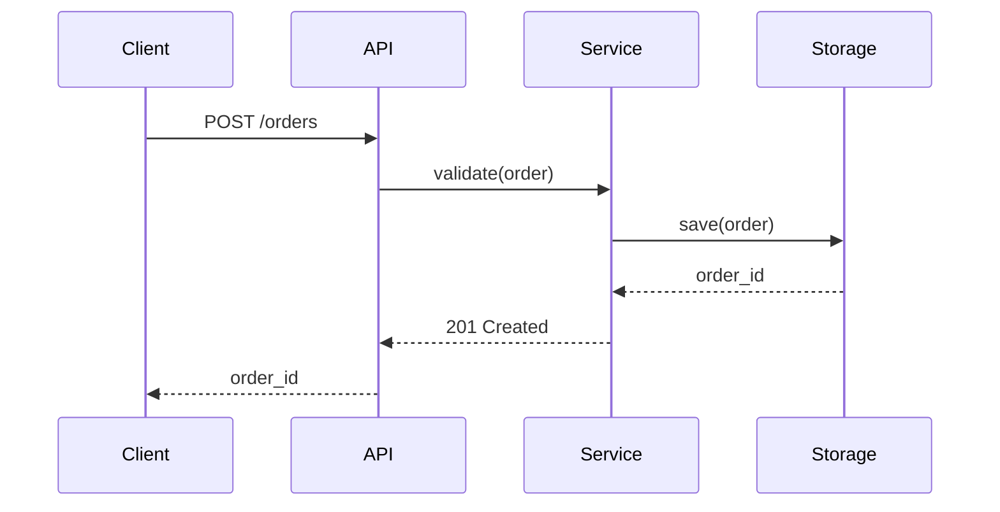

# Architecture Documentation

## 1. When to Write

Start an architecture document early — as soon as there are design decisions worth recording. Update it whenever a significant architectural choice is made or reversed. Do not defer it to "after the prototype."

A project typically needs an ARCHITECTURE.md (or docs/architecture.md) when:

- It spans more than a few modules or packages
- It makes non-obvious design decisions (why this library, pattern, or approach?)
- It has multiple contributors who need a shared mental model
- It integrates with external systems or services
- A new contributor would struggle to understand the structure from code alone

## 2. File Location

Place the architecture document at the project root:

```
project-root/
├── ARCHITECTURE.md     ← recommended (top-level, highly visible)
├── src/
├── tests/
└── docs/
    └── architecture.md ← alternative (alongside other docs)
```

For greenfield projects, prefer `ARCHITECTURE.md` at the root — it is the first file a new contributor looks for. For documentation-heavy projects, place it under `docs/architecture.md`.

## 3. What to Include

### 3.1 High-Level Overview

A few paragraphs explaining the system's structure and the rationale behind major choices. Answer:

- **What** is this system? One or two sentences.
- **Why** was this architecture chosen? (layering, async vs. sync, database choice, etc.)
- **Who** is the audience? (end users, library consumers, operators)

### 3.2 Module Map

Show how the code is organized and how modules depend on each other. Use an ASCII diagram:

```
┌──────────┐    ┌───────────┐    ┌──────────┐
│  API     │───▶│  Service  │───▶│  Storage  │
│  Layer   │    │  Layer    │    │  Layer    │
└──────────┘    └───────────┘    └──────────┘
```

For each module, include:

| What | Example |
|---|---|
| **Name** | `api-layer/` |
| **Responsibility** | Handles HTTP requests, validation, and response formatting |
| **Dependencies** | Depends on `service-layer/` |
| **Key types** | `Router`, `Handler`, `Middleware` |

### 3.3 Key Design Decisions

For each important decision, use a structured record:

```markdown
### Decision: Use PostgreSQL over MongoDB

- **Context**: We needed strong consistency guarantees for financial transactions.
- **Decision**: Use PostgreSQL 16 with the `pg_stat_statements` extension.
- **Alternatives considered**:
  - MongoDB: eventual consistency would require application-level conflict resolution.
  - SQLite: lacks connection pooling for the expected 500+ concurrent users.
  - CockroachDB: overkill for single-region deployment.
- **Consequences**:
  - (+) Strong consistency, familiar SQL tooling, excellent `COPY` support for bulk loads.
  - (-) Vertical scaling ceiling; schema migrations require careful planning.
  - (-) Joins across shards become expensive if we need to shard later.
```

Do not delete old decision records when a decision is reversed — note the reversal and link to the new record. This preserves history.

### 3.4 Data Flow

Describe how data moves through the system for the primary use cases. Use sequence diagrams (ASCII or Mermaid) for multi-step flows:



For simpler flows, a numbered list suffices:

1. Client sends a POST to `/orders` with an order payload.
2. API layer validates the payload schema.
3. Service layer applies business rules (credit check, inventory reservation).
4. Storage layer persists the order and returns the ID.
5. API layer responds with HTTP 201 and the order ID.

### 3.5 Limitations and Future Work

Be honest about known constraints. This section signals maturity and builds trust:

```markdown
## Limitations

- **Single-region**: All services deploy to us-east-1. Cross-region failover is not implemented.
- **No horizontal scaling**: The storage layer is a single PostgreSQL instance. Plan for read replicas when read load exceeds 5000 QPS.
- **No audit log**: Operations are not timestamped for compliance. Needed for SOC 2.

## Future Work

- [ ] Cross-region replication and failover (tracked in #417)
- [ ] Read replicas for analytics queries (#418)
- [ ] Immutable audit log (#419)
```

### 3.6 Security and Operational Considerations

Include a brief section on:

- **Authentication / Authorization**: How does the system verify identity and enforce permissions?
- **Secrets management**: Where do secrets live? (env vars, vault, secret store)
- **Observability**: Logging, metrics, tracing — what is emitted and where?
- **Deployment**: CI/CD pipeline, infrastructure-as-code approach, rollback strategy.

## 4. Maintenance

### 4.1 Sync with Code

Keep the architecture document in sync with the code. When:

- A module is renamed, split, or removed → update the module map
- A dependency is added or swapped → update the dependency list
- A decision is revisited and reversed → add a new decision record noting the reversal

### 4.2 Review Cadence

- **Per commit**: Update the affected sections in the same commit that changed the code. Never leave architecture doc updates as a separate follow-up task.
- **Per release**: Do a full review of the architecture document. Check that all module descriptions, diagrams, and decision records are still accurate.
- **Per major version**: Re-evaluate every decision record. Archive records that are no longer relevant.

### 4.3 Stale Content

Architecture documentation that is out of date is worse than no documentation — it actively misleads. When you encounter stale content while working on unrelated code, fix the discrepancy immediately or add a TODO comment referencing a tracking issue. Do not defer it.

## 5. Tooling

| Tool | When to Use |
|---|---|
| **Mermaid** (`.md` code blocks) | Diagrams for data flow, sequence, and deployment architecture. Supported by GitHub, GitLab, and most markdown renderers. |
| **ASCII art** | Quick diagrams inline in code comments or simple module maps. No rendering dependency. |
| **Structurizr / C4 model** | Large systems with multiple teams. Generates diagrams from a single DSL source of truth. |
| **Diagrams.net / drawio** | When a WYSIWYG editor is preferred. Commit the source file (`.drawio`) and export PNG/SVG for the rendered doc. |

## 6. Related Skills

- **[documentation-practices](../documentation-practices/SKILL.md)** — General documentation conventions (docstrings, README, inline comments).
- **[agents-doc](../agents-doc/SKILL.md)** — Writing and maintaining AGENTS.md for AI agent instructions.
- **[review-plan](../review-plan/SKILL.md)** — Reviewing architecture documents and feature plans for consistency and completeness.
- **[data-pipeline-architecture](../data-pipeline-architecture/SKILL.md)** — The three-stage model for data processing (ingestion → transformation → output). Apply when documenting data flow in system architecture.
